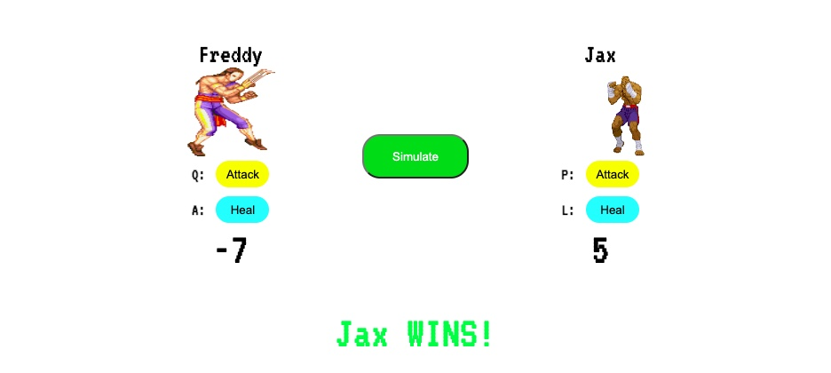

# JS Fighter

JS Fighter is a simple application built in JavaScript that demostrates simple JS concepts such as random value generation and user sounds. Users have the option to play as 2 characters that use "q & e' and "p & l" respectively. Users are able to deal an attack and heal with these keys. 

## ScreenShot of Game: 

## Technologies Used: 
  
  

